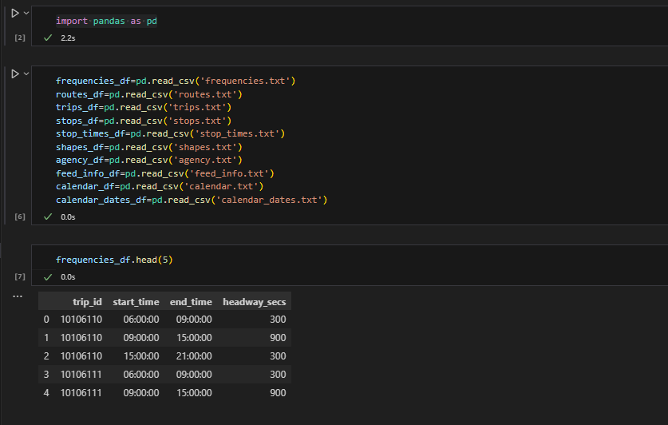
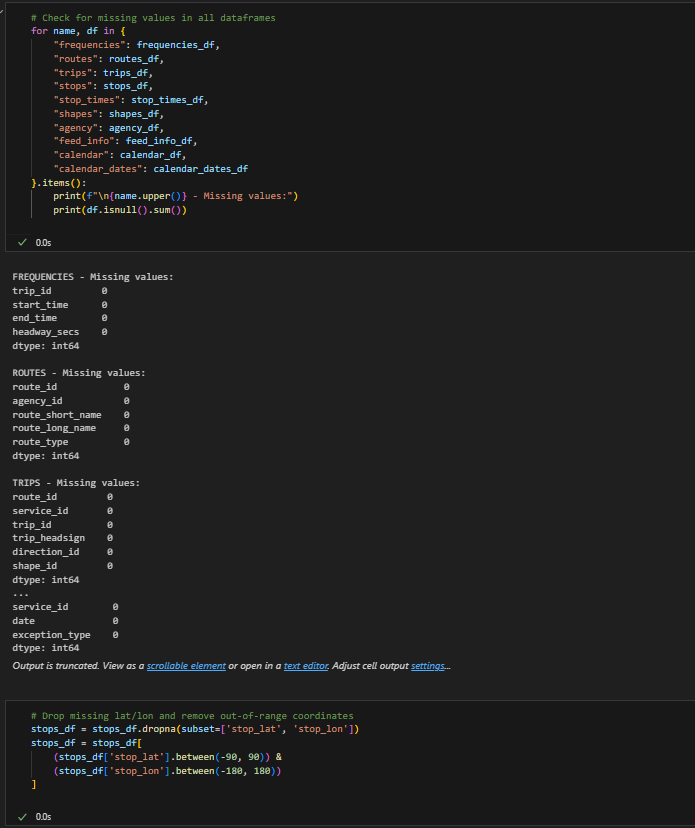
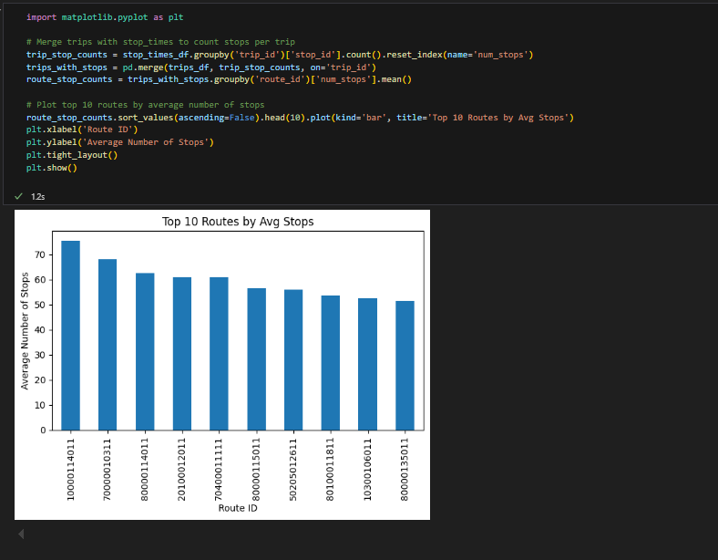
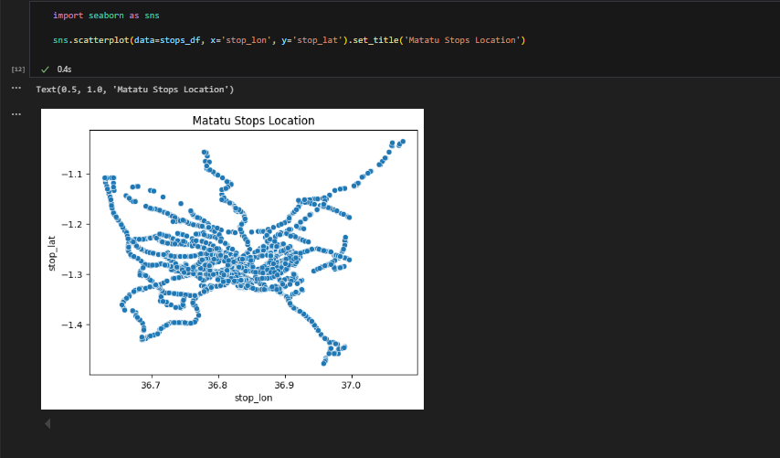
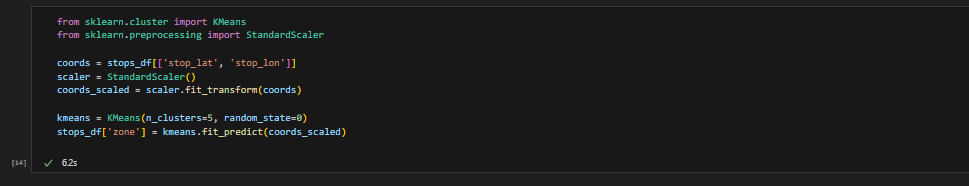
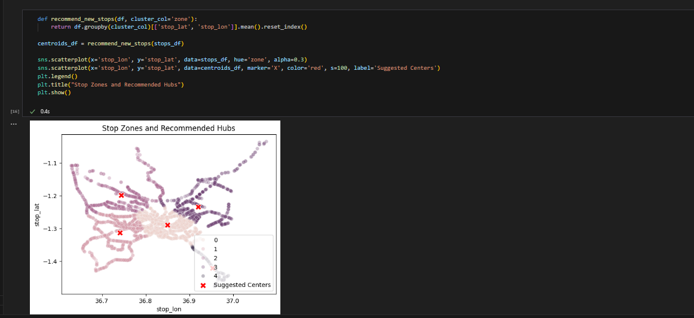

# Nairobi Matatu Public Transport Analysis 🚍

## 📌 Project Overview
This project analyzes Nairobi's public Matatu transport system using real-world GTFS data. The goal is to discover stop patterns, cluster zones, and identify optimization points in route planning and stop distribution.

- **Source**: [MIT News](https://news.mit.edu/2015/digital-matatus-project-makes-invisible-visible-0826)
- **Dataset**: [GTFS feed from Digital Matatus](https://www.digitalmatatus.com/map.html)
- **Sector**: Transportation
- **Tools**: Python (for cleaning, clustering), Power BI (for dashboards)

## 🎯Problem Statement:
**"Can we analyze traffic patterns and public transport delays in major African cities to recommend improvements for urban mobility?"**

## 🧪 Methodology
1. Cleaned and joined GTFS data (stops, trips, stop_times)
2. Used KMeans clustering to identify transport zones
3. Visualized stops, routes, and clusters
4. Built interactive Power BI dashboard

## ✅ Final Answer Based on Your Analysis:
Yes — through GTFS data and big data analytics, we were able to analyze stop distribution, route usage, and clustering patterns in Nairobi’s public transport system.
By applying data cleaning, exploratory analysis, and machine learning (KMeans clustering), we uncovered valuable insights that highlight both high-coverage areas and underserved zones. The interactive Power BI dashboard visualized these patterns for actionable recommendations.

## 🧠 Key Findings:
1. **Zone 3 has the highest number of stops**, showing a concentration of service in central or high-demand areas.
2. **Several routes serve long distances with relatively few stops**, suggesting either express routes or potential service gaps.
3. **KMeans clustering revealed 5 distinct transport zones**, showing spatial groupings of stops that may guide future infrastructure planning.
4. **Matrix and bar charts** helped compare stop coverage across zones and routes, identifying imbalances.
5. **Temporal filters (like weekdays)** could be used to analyze stop activity by service day.

## 🛠 Recommendation:
* Redistribute stops or improve service coverage in zones with low stop density
* Optimize under-utilized routes by adding intermediate stops
* Use clustering and mapping regularly to monitor coverage and growth needs
* Integrate real-time traffic or GPS data in the future to analyze live delays

## 🔭 Future Work:
* Include **trip timing and arrival delay data** (if available) for actual delay analysis
* Extend the model to other cities like Kigali or Kampala for regional comparison
* Add demographic or population layers to target planning by community needs

---

# 📊 Data Preprocessing in Python

## 1. LOAD THE ENTIRE GTFS dataset
```python                                                                                                                                                                
import pandas as pd        
frequencies_df=pd.read_csv('frequencies.txt')
routes_df=pd.read_csv('routes.txt')
trips_df=pd.read_csv('trips.txt')
stops_df=pd.read_csv('stops.txt')
stop_times_df=pd.read_csv('stop_times.txt')
shapes_df=pd.read_csv('shapes.txt')
agency_df=pd.read_csv('agency.txt')
feed_info_df=pd.read_csv('feed_info.txt')
calendar_df=pd.read_csv('calendar.txt')
calendar_dates_df=pd.read_csv('calendar_dates.txt')                                                                
frequencies_df.head(5) 
```


## 2. Inspect and Clean the Dataset
Checking for missing values, data types, and outliers.
```python
for name, df in {
    "frequencies": frequencies_df,
    "routes": routes_df,
    "trips": trips_df,
    "stops": stops_df,
    "stop_times": stop_times_df,
    "shapes": shapes_df,
    "agency": agency_df,
    "feed_info": feed_info_df,
    "calendar": calendar_df,
    "calendar_dates": calendar_dates_df
}.items():
    print(f"\n{name.upper()} - Missing values:")
    print(df.isnull().sum())
```
```python
# Drop missing lat/lon and remove out-of-range coordinates
stops_df = stops_df.dropna(subset=['stop_lat', 'stop_lon'])
stops_df = stops_df[
    (stops_df['stop_lat'].between(-90, 90)) & 
    (stops_df['stop_lon'].between(-180, 180))
]
```


## 3. Exploratory Data Analysis (EDA)

# *Number of stops per route
Generates descriptive statistics
```python
import matplotlib.pyplot as plt

# Merge trips with stop_times to count stops per trip
trip_stop_counts = stop_times_df.groupby('trip_id')['stop_id'].count().reset_index(name='num_stops')
trips_with_stops = pd.merge(trips_df, trip_stop_counts, on='trip_id')
route_stop_counts = trips_with_stops.groupby('route_id')['num_stops'].mean()

# Plot top 10 routes by average number of stops
route_stop_counts.sort_values(ascending=False).head(10).plot(kind='bar', title='Top 10 Routes by Avg Stops')
plt.xlabel('Route ID')
plt.ylabel('Average Number of Stops')
plt.tight_layout()
plt.show()
```

## *Map stops
Visualizes distributions and relationships among `Matatu Stops Location`
```python
import seaborn as sns
sns.scatterplot(data=stops_df, x='stop_lon', y='stop_lat').set_title('Matatu Stops Location')
```


## 4. Apply Clustering (K-Means)
- Used KMeans clustering on stop coordinates to group them into transport zones
- Trained model using scaled latitude/longitude
```python
from sklearn.cluster import KMeans
from sklearn.preprocessing import StandardScaler

coords = stops_df[['stop_lat', 'stop_lon']]
scaler = StandardScaler()
coords_scaled = scaler.fit_transform(coords)

kmeans = KMeans(n_clusters=5, random_state=0)
stops_df['zone'] = kmeans.fit_predict(coords_scaled)
```


## 5. Model Evaluation
- Used Silhouette Score from `sklearn.metrics` to evaluate KMeans clustering quality
```python
from sklearn.metrics import silhouette_score
score = silhouette_score(coords_scaled, stops_df['zone'])
print(f"Silhouette Score: {score:.2f}")
```


## 6. INCORPORATE INNOVATION
`Innovative Idea:`
 - Implemented a custom function to recommend new transit hubs by calculating cluster centers
 - Plotted stop clusters + centroids to visually suggest new transport centers
```python
def recommend_new_stops(df, cluster_col='zone'):
    return df.groupby(cluster_col)[['stop_lat', 'stop_lon']].mean().reset_index()
centroids_df = recommend_new_stops(stops_df)
sns.scatterplot(x='stop_lon', y='stop_lat', data=stops_df, hue='zone', alpha=0.3)
sns.scatterplot(x='stop_lon', y='stop_lat', data=centroids_df, marker='X', color='red', s=100, label='Suggested Centers')
plt.legend()
plt.title("Stop Zones and Recommended Hubs")
plt.show()
```


---

# POWER BI DASHBOARD TASKS
## 📊 Power BI Dashboard – Visuals & Interactivity

This dashboard presents insights from Nairobi's public transport system using cleaned GTFS data. It helps identify zone coverage, route efficiency, and spatial distribution of Matatu stops. The dashboard uses interactive visuals and filters for in-depth urban mobility analysis.

---

### 🔍 Dashboard Visuals Overview

| **Visual Name**             | **Type**     | **Data Source**         | **Purpose / Insight**                                                                      |
| --------------------------- | ------------ | ----------------------- | ------------------------------------------------------------------------------------------ |
| **Stop Locations Map**      | Map          | `stops` (with clusters) | Displays all public transport stops on the city map, color-coded by KMeans-generated zones |
| **Top Routes Bar Chart**    | Bar Chart    | `trips`                 | Highlights routes with the highest number of trips (route popularity)                      |
| **Zone Distribution Donut** | Donut Chart  | `stops`                 | Shows the proportion of stops in each zone (transport coverage)                            |
| **Matrix: Zones vs Routes** | Matrix Table | `stops`, `trips`        | Cross-tab of how many stops each route has per zone (route-zone distribution)              |
| **Trip & Stop Table**       | Table        | `stop_times`, `stops`   | Provides detailed list of stops, trip IDs, arrival times, and stop zones                   |
| **KPI Summary Cards**       | Card         | All tables              | Displays key summary stats: total stops, routes, zones, and average stops per route        |

---

### 🎛️ Slicers and Interactive Filters

| **Slicer Field**   | **Table**   | **Purpose / Interaction**                                                         |
| ------------------ | ----------- | --------------------------------------------------------------------------------- |
| **Trip HeadSign**  | `trips`     | Lets user filter by trip destination or direction (e.g., “CBD – Kenyatta Market”) |
| **Service ID**     | `calendar`  | Filter trips based on weekly service definitions                                  |
| **Weekday Fields** | `calendar`  | Filters trips that are active on selected days (Monday–Sunday)                    |
| **Slicer Search**  | All slicers | Enables text search for faster navigation of long lists (e.g., trip names)        |

---

### 🧠 Tip:

All visuals are linked through active relationships. Clicking on a route, trip, or zone updates every related visual. Conditional formatting, custom tooltips, and data bars were added to improve visual clarity and highlight key patterns.
